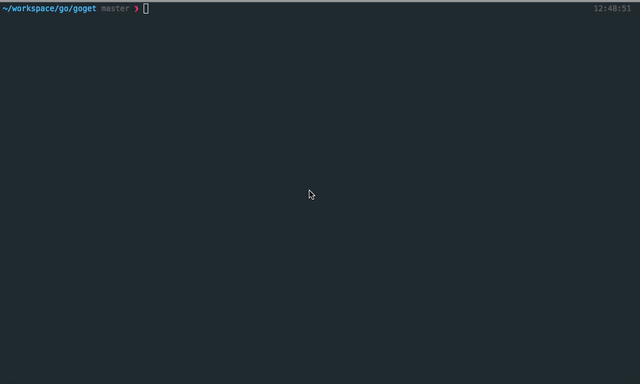

# goget
Download stuff from the internet with ease.

The idea is to have one command line tool to help me download an entire index of files, if need be.

Usage:

`$ go build goget`

`$ ./goget -m=100 -url=https://stuff.mit.edu/afs/sipb/contrib/pi/pi-billion.txt`

###### Demo

