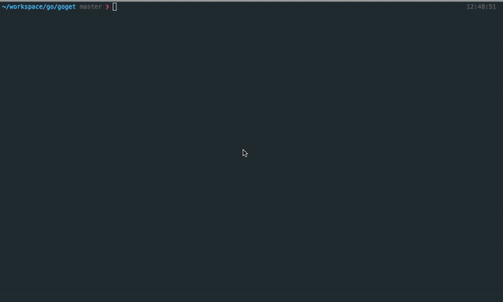

# goget
Download stuff from the internet with ease.

The idea is to have one command line tool to help me download an entire index of files, if need be.

Usage:

`$ go build goget`

`$ ./goget -m=100 -url=https://stuff.mit.edu/afs/sipb/contrib/pi/pi-billion.txt`

Command Line options:
  1. `-m`: Amount of Memory to be allocated for download. This is the memory that is split and allocated for the Download of files and isn't related to the total memory consumption by Go.
  2. `-url` : The url of a file (or an index that serves up an HTML with a list of file URLs) to be downloaded
  3. `-resume` : Resume a download if possible. `-resume=true`
  4. `-r` : Recursion Depth to be used in case of downloading an Index. If the depth = 2, the current list of files and files one level down will be downloaded.
  5. `-o` : Output Directory. If the directory does not exist, it will be created.

###### Demo (downloading a deep index)

